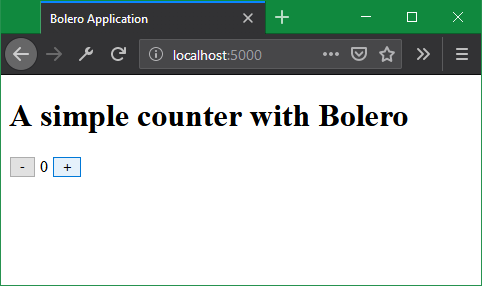

### What is Bolero?

Bolero is a set of free and open-source libraries and tools to write [**WebAssembly**](https://webassembly.org/) applications in [**F#**](https://fsharp.org/). With it, you can write fully dynamic client-side web applications from the comfort of a strongly-typed functional language, all with great performance.

Bolero is built on top of [Blazor](https://blazor.net/) and adds a lot of features designed specifically to work in F#:

* [Elmish](Elmish) Model-View-Update architecture for a functional approach to reactive content.
* [HTML-in-F#](HTML) syntax inspired by WebSharper.UI and Fable.
* Alternatively, [HTML templates](Templating) with hot reloading provide a comfortable design experience.
* [URL Routing](Routing) the F# way, automatically matching URLs with F# union types.
* Easy [Remoting](Remoting) with an ASP.NET Core server side.
* F#-specific optimizations: Bolero strips F# metadata from compiled assemblies, reducing the download size of the application.

### Creating a project

You can develop Bolero applications on Windows, OSX or Linux. It only has one prerequisite: the [.NET Core SDK](https://dotnet.microsoft.com/download/dotnet-core), version 3.0.0 or newer.

The easiest way to get started is to use Bolero's dotnet template. To install it, run the following command:

```shell
dotnet new -i Bolero.Templates
```

Then, you can create a new Bolero application:

```shell
dotnet new bolero-app -o HelloWorld
```

This will create a new folder `HelloWorld` and create an application inside it. The template has additional options, described [at its home page](https://github.com/fsbolero/Template). You can run it with:

```shell
cd HelloWorld
dotnet run -p src/HelloWorld.Server
```

This will start the server and run the following minimal application at `localhost:5000`:



### Discovering the startup project

The solution you just created comprises two projects.

* `src/HelloWorld.Client` is the project that gets compiled to WebAssembly, and contains your client-side code.

    * `Main.fs` contains the main body of the page. This is where the meat of the application is: as you develop, you will mostly be coding here and in new files referenced from here.

    * `wwwroot/` contains static content. In particular, `index.html` is the actual page that is served. It contains a script reference to `blazor.webassembly.js`, which in turn loads your application.
    
        If you want to add styles and images to your application, this is the folder to put them.

    * `Startup.fs` sets up Blazor to get the application started. You will rarely need to touch it: essentially only to set up [remoting](Remoting), if you want to use it.

* `src/HelloWorld.Server` is an ASP.NET Core application that serves as the host. This project is optional: if you pass `--server=false` when creating the solution with `dotnet new`, then it will not be created. Note however that it is necessary for [templating hot reloading](Templating#hot-reloading) and [remoting](Remoting).

    * `Startup.fs`, similarly to its client counterpart, sets up ASP.NET Core to get the server started.
